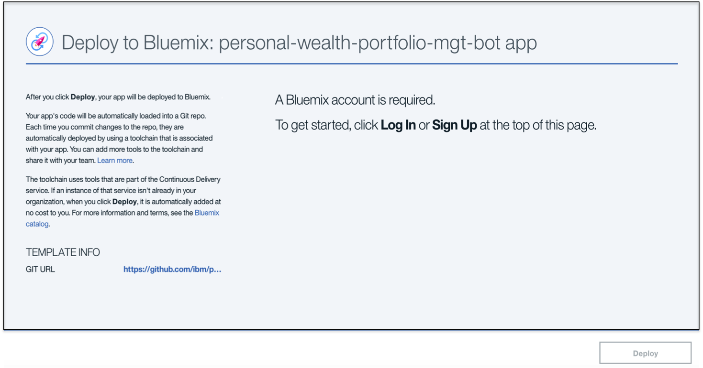
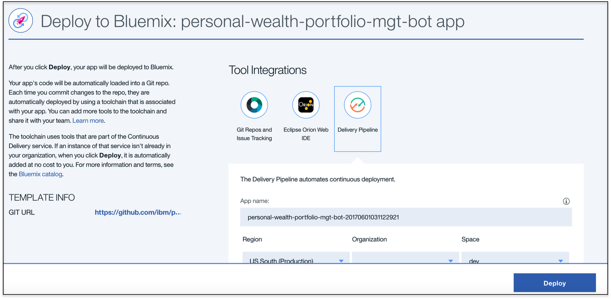
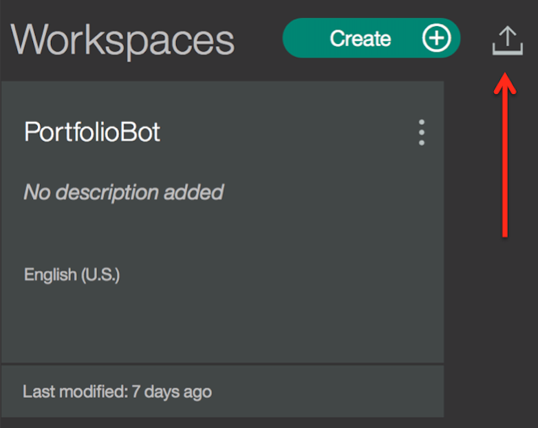
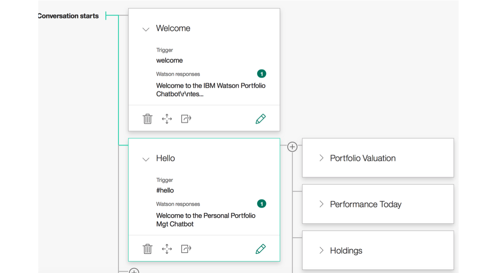
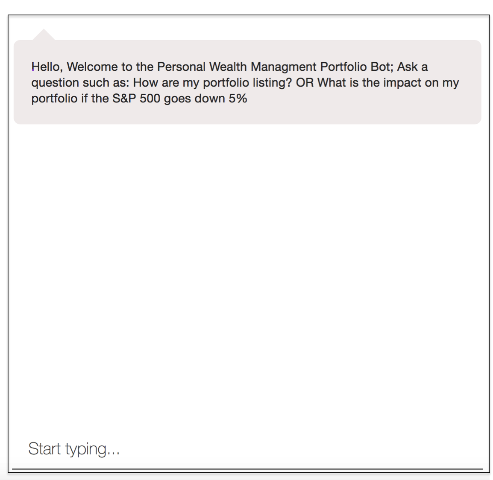
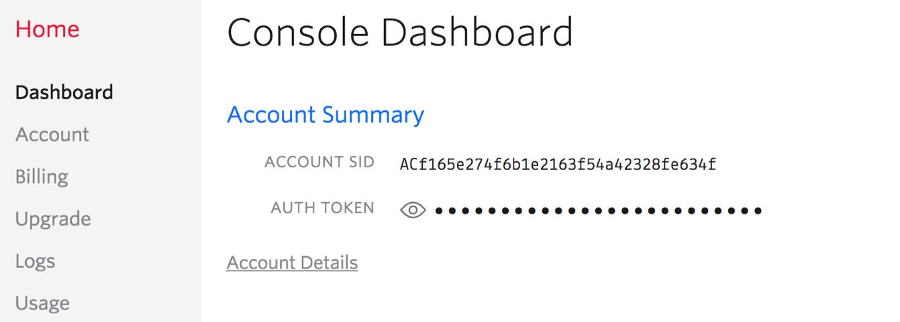
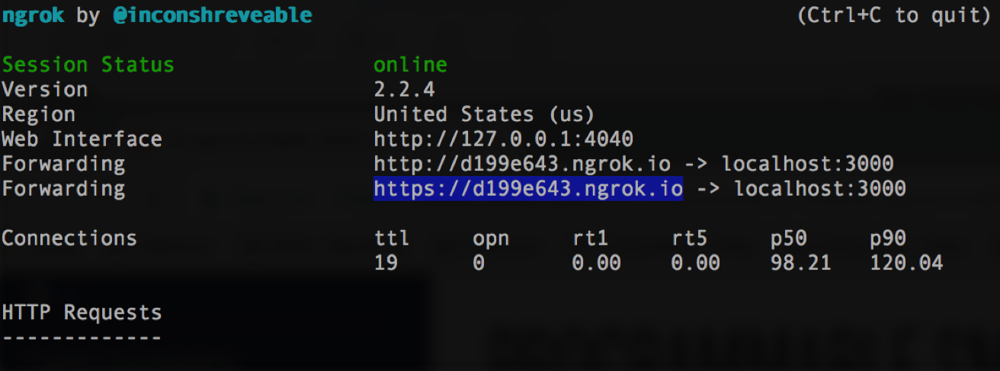
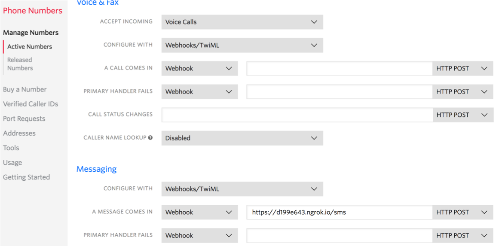
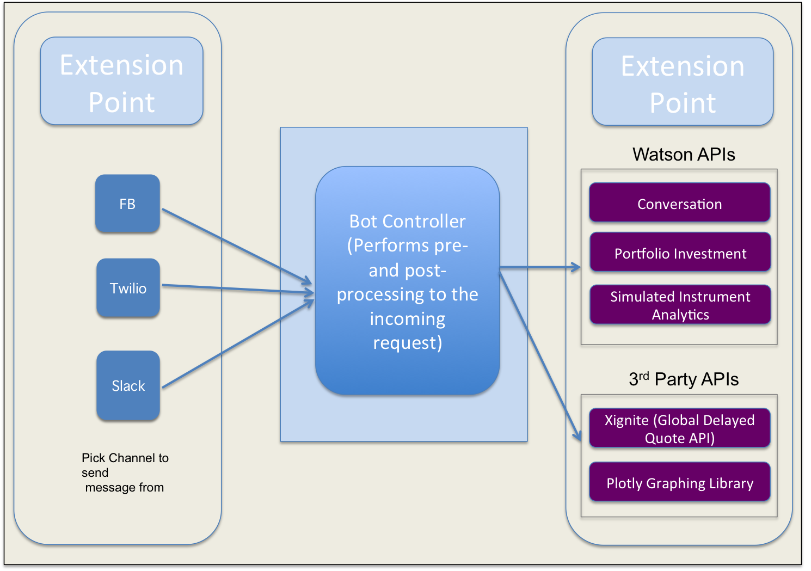

[](https://travis-ci.org/IBM/personal-wealth-portfolio-mgt-bot)

# Personal Wealth Portfolio Management Bot

*Read this in other languages: [한국어](README-ko.md), [中国](README-cn.md), [Português](README-pt.md) .*

In this developer pattern we will create a financial-based Watson Assistant based chatbot
that allows a user to: 1) use an Investment Portfolio service to query his or her investment portfolios and associated holdings 2) use the Simulated Instrument Analytics service to compute analytics on securities under a given scenario. 3) understand how to swap between alternative interfaces:  a) web interface b) TwilioSMS

When the reader has completed this pattern, he or she will understand how to:

* Create a chatbot dialog with Watson Assistant
* Set up multiple interfaces with the Watson Assistant bot: Web & Twilio
* Access, seed and send data to the Investment Portfolio Service
* Send data along with a scenario to the Simulated Instrument Analytics service to retrieve analytics

Click here to view the [IBM Pattern](https://developer.ibm.com/code/patterns/create-an-investment-management-chatbot/) for this project.

## Flow


## Prerequisites

You will need the following accounts and tools:

#### Git Command
You need the `git` command to download repo to your system.  Download Git at the following link [here](https://git-scm.com/book/en/v2/Getting-Started-Installing-Git)

#### Curl Command
The `curl` command is a software package which consists of command line tool and a library for tranferring data using URL syntax. Download curl release from the following link [here](https://curl.haxx.se/dlwiz/)

#### IBM Cloud CLI
To interact with the hosted offerings, the IBM Cloud CLI will need to be installed beforehand. The latest CLI releases can be found at the link [here](https://console.bluemix.net/docs/cli/reference/bluemix_cli/download_cli.html#download_install). An install script is maintained at the mentioned link, which can be executed with one of the following commands

```bash
# Mac OSX
curl -fsSL https://clis.ng.bluemix.net/install/osx | sh

# Linux
curl -fsSL https://clis.ng.bluemix.net/install/linux | sh

# Powershell
iex(New-Object Net.WebClient).DownloadString('https://clis.ng.bluemix.net/install/powershell')
```

After installation is complete, confirm the CLI is working by printing the version like so

```bash
bx -v
```

## Included Components

* IBM Cloud Watson Assistant
* IBM Cloud Cloudant NoSQL DB
* IBM Cloud Investment Portfolio
* IBM Cloud Simulated Instrument Analytics

## Relatd Technologies

* TwilioSMS
* Node.js

## Steps

Use the ``Deploy to IBM Cloud`` button **OR** create the services and run ``Run Locally``.

Use the IBM Cloud for Financial Services to build the future of financial services with to help from Watson and developer starter kits. Visit [https://developer.ibm.com/finance/](https://developer.ibm.com/finance/) for more information.

## Deploy to IBM Cloud

[](https://bluemix.net/deploy?repository=https://github.com/IBM/personal-wealth-portfolio-mgt-bot.git)

Use Ctrl-click on the Deploy to `IBM Cloud` button below to open the deployment process in a separate tab.

1. Log in to your IBM Cloud account before deploying. If already logged in, then ignore this step.

   

2. We can see that the app is ready to be deployed, and we need to ensure that the App name, region, Organization, Space is valid before pressing _Deploy_.

   

3. In Toolchain, the app is deployed. There are also option to edit code via the Eclipse IDE and git if required.

   

4. You should see two stages pass successfully once your _Deploy Stage_ completes

   

5. To see the app and services created and configured for this pattern, use the IBM Cloud dashboard. The app is named `personal-wealth-portfolio-mgt-bot` with a unique suffix:

   * [**Watson Assistant**](https://console.bluemix.net/catalog/services/watson-assistant-formerly-conversation)
   * [**Cloudant NoSQL DB**](https://console.ng.bluemix.net/catalog/services/cloudant-nosql-db/)
   * [**Investment Portfolio**](https://console.ng.bluemix.net/catalog/services/investment-portfolio)
   * [**Simulated Instrument Analytics**](https://console.ng.bluemix.net/catalog/services/simulated-instrument-analytics)

   > **NOTE:** There are a few more steps you need to complete before you can run the application.

### A. Seed the Investment Portfolio Service

You now need to manually seed your Investment Portfolio. For all these steps - replace **userid** and **password** with the credentials from your IBM Cloud Service.

> **NOTE:** `{service-user-id}` is the user id associated with your Portfolio Investment Service

> **NOTE:** `{service-user_password}` is the password associated with your Portfolio Investment Service

1. Example of creating a portfolio entry in your Portfolio Investment Service:

```
curl -X POST -u "{service-user-id}":"{service-user_password}" --header 'Content-Type: application/json' --header 'Accept: application/json' -d '{ "name":"P1", "timestamp": "2017-02-24T19:53:56.830Z", "closed": false, "data": { "manager": "Edward Lam" }}' 'https://investment-portfolio.mybluemix.net/api/v1/portfolios'
```

2. Example of creating holdings in your entry:

```
curl -X POST -u "{service-user-id}":"{service-user_password}" --header 'Content-Type: application/json' --header 'Accept:application/json' -d '{ "timestamp": "2017-05-05T19:53:56.830Z", "holdings": [ { "asset": "IBM", "quantity": 1500, "instrumentId": "CX_US4592001014_NYQ"}, { "asset": "GE", "quantity": 5000, "instrumentId": "CX_US3696041033_NYQ" }, { "asset": "F", "quantity": 5000, "instrumentId": "CX_US3453708600_NYQ" }, { "asset": "BAC", "quantity": 1800, "instrumentId": "CX_US0605051046_NYS" } ] }' 'https://investment-portfolio.mybluemix.net/api/v1/portfolios/P1/holdings'
```

### B. Configuring your Environment Variables in IBM Cloud

Before you can actually run the application, you need to add two environment variables in IBM Cloud:

Go to the _Run time_ tab of your application. Scroll to the bottom of the screen and add the following environment variables:

| Name                                                    | Value                                |
|---------------------------------------------------------|--------------------------------------|
| `USE_WEBUI`                                             | `true`                               |
| `CRED_SIMULATED_INSTRUMENT_ANALYTICS_SCENARIO_FILENAME` | `./resources/spdown5_scenario.csv`   |

Click **Save** to redeploy your application.

### C. Running the application from IBM Cloud

Now you are ready to run your application from IBM Cloud. Select the URL from the dashboard.


> **NOTE:** If you get a *Not Authorized* message - you need to confirm that the credentials you used match the credentials in IBM Cloud.

## Running the application Locally

> NOTE: These steps are only needed when running locally instead of using the ``Deploy to IBM Cloud`` button

1. [Clone the repo](#1-clone-the-repo)
2. [Create IBM Cloud services](#2-create-ibm-cloud-services)
3. [Watson Assistant Service](#3-watson-assistant-service)
4. [Seed Investment Portfolio](#4-seed-investment-portfolio)
5. [Configure Manifest file](#5-configure-manifest)
6. [Configure .env file](#6-configure-env-file)
7. [Update ``controller.js`` file](#7-update-controllerjs-file)
8. [Run the application](#8-run-application)

### 1. Clone the repo

Clone the `personal-wealth-portfolio-mgt-bot` code locally. In a terminal, run:

```
git clone https://github.com/IBM/personal-wealth-portfolio-mgt-bot.git
```

### 2. Create IBM Cloud services

Create the following services:

* [**Watson Assistant**](https://console.ng.bluemix.net/catalog/services/conversation)
* [**Cloudant NoSQL DB**](https://console.ng.bluemix.net/catalog/services/cloudant-nosql-db/)
* [**Investment Portfolio**](https://console.ng.bluemix.net/catalog/services/investment-portfolio)
* [**Simulated Instrument Analytics**](https://console.ng.bluemix.net/catalog/services/simulated-instrument-analytics)

> **NOTE:** Because this pattern uses 4 IBM Cloud services, you may hit your limit for the number of services you have instantiated. You can get around this by removing services you don't need anymore. Additionally - if you hit the limit on the number of Apps you have created, you may need to also remove any that you don't need anymore.

* Record the user ID and password from the credentials tab on the Assistant Service.

### 3. Watson Assistant Service

You can choose to have a workspace dynamically created for you or create one yourself within your IBM Cloud Service. If you choose to create yourself, then follow these steps:

The Assistant service must be trained before you can successfully use this application.  The training data is provided in the file: [`resources/workspace.json`](resources/workspace.json)

1. Make sure you are logged into IBM Cloud

2. Navigate to upper left hand side and click on the 3 parallel lines and select Dashboard from the left hand navigation panel.

3. Scroll down and under "All Services" - select the instance of the Assistant service that you are using

4. Once on the Service details page, scroll down (if necessary) and click green Launch tool button on the right hand side of the page. This will launch the tooling for the Assistant service, which allows you to build dialog flows and train your chatbot. This should take you to your workspace in the Assistant service which represents a unique set of chat flows and training examples. This allows you to have multiple chatbots within a single instance of the Assistant service.

5. Once on the page, you will see the option to either "Create" a new workspace, or "import" an existing one. We are going to "import" a premade chatbot for this example, so select "Import" (click on the arrow next to the create button).

    

6. Click Choose a file, navigate to the resources directory of your clone of the repository for this project, and select the file workspace.json. Once the file is selected, ensure that the "Everything" (Intents, Entities, and Dialog) option is selected.

7. Click Import to upload the .json file to create a workspace and train the model used by the Assistant service.

   **NOTE: Record your Workspace ID to use later**

  To find your workspace ID once training has completed, click the three vertical dots in the upper right-hand corner of the Workspace pane, and select View details. Once the upload is complete, you will see a new workspace.  In order to connect this workspace to our application, we will need to include the Workspace ID in our environment variables  on your application dashboard (if you used the ``Deploy to IBM Cloud`` button or save in the file `.env` if you are deploying ``locally``. Save this id.

8. *Optionally*, you may want to explore the conversation dialog. select the workspace and choose the **Dialog** tab, here's a snippet of the dialog:

  

### 4. Seed Investment Portfolio

Execute section A of the ``Deploy to IBM Cloud`` section

### 5. Configure Manifest

Edit the [`manifest.yml`](manifest.yml) file in the folder that contains your code and replace `portoflio-chat-newbot` with a unique name for your application. The name that you specify determines the application's URL, such as `your-application-name.mybluemix.net`. Additional - update the service labels and service names so they match what you have in IBM Cloud. The relevant portion of the `manifest.yml` file looks like the following:

   ```yml
   declared-services:
     Cloudant-us:
       label: cloudantNoSQLDB
       plan: Lite
     WatsonAssistant-us:
       label: conversation
       plan: free
     Investment-Portfolio:
       label: fss-portfolio-service
       plan: fss-portfolio-service-free-plan
     Simulated-Instrument-Analytics:
       label: fss-scenario-analytics-service
       plan: fss-scenario-analytics-service-free-plan
   applications:
   - services:
     - Cloudant-us
     - WatsonAssistant-us
     - Investment-Portfolio
     - Simulated-Instrument-Analytics
     name: portoflio-chat-newbot
     path: .
     memory: 256M
     instances: 1
     domain: mybluemix.net
     disk_quota: 1024M
   ```

### 6. Configure .env file

1. Create a `.env` file in the root directory of your clone of the project repository by copying the sample `.env.example` file using the following command:

> **NOTE:** Most files systems regard files with a "." at the front as hidden files.  If you are on a Windows system, you should be able to use either [GitBash](https://git-for-windows.github.io/) or [Xcopy](https://www.microsoft.com/resources/documentation/windows/xp/all/proddocs/en-us/xcopy.mspx?mfr=true)

  ```bash
  cp .env.example .env
  ```

   Now update the credentials with the IBM Cloud credentials for each of the services you created in [Step 2](#2-create-bluemix-services). The `.env` file will look something like the following:

   ```ini

   USE_WEBUI=true

   # Uncomment and use either username+password or IAM apikey
   CONVERSATION_USERNAME=8baa4dc5-1afd-4bf1-992d-2eee3cbac21f
   CONVERSATION_PASSWORD=Pnu3u23qywMT
    
   #Watson Assistant Authentication using IAM
   #CONVERSATION_IAM_APIKEY=<put assistant IAM apikey here>

   #CLOUDANT
   CLOUDANT_URL=

   #INVESTMENT PORTFOLIO
   CRED_PORTFOLIO_USERID=
   CRED_PORTFOLIO_PWD=
   URL_GET_PORTFOLIO_HOLDINGS=https://investment-portfolio.mybluemix.net/

   CRED_SIMULATED_INSTRUMENT_ANALYTICS_URL=https://fss-analytics.mybluemix.net/
   CRED_SIMULATED_INSTRUMENT_ANALYTICS_ACCESSTOKEN=
   CRED_SIMULATED_INSTRUMENT_ANALYTICS_SCENARIO_FILENAME=./resources/spdown5_scenario.csv

   #TWILIO
   USE_TWILIO=false
   USE_TWILIO_SMS=false
   TWILIO_ACCOUNT_SID=
   TWILIO_AUTH_TOKEN=
   TWILIO_API_KEY=
   TWILIO_API_SECRET=
   TWILIO_IPM_SERVICE_SID=
   TWILIO_NUMBER=
   ```

### 7. Update controller.js file

One additional step is that you need to comment out two lines in the Controller file to set the userid and password of the investment portfolio service (lines 66-70)


### 8. Run Application

1. Install the dependencies you application need:

   ```bash
   npm install
   ```

2. Start the application locally:

   ```bash
   npm start
   ```

3. Test your application by going to: [http://localhost:3000/](http://localhost:3000/)

4. Start a conversation with your bot:

   

## Configure Twilio (Optional)

You still have one more step if you are planning to use Twilio as the interface. We have to update a couple more environment variables. Again - this is an optional step. By default the app interfaces with a Web UI; but this enables an interface with Twilio.

**NOTE:** Using Twilio is an option, the application works with the Web UI by default. So only do the Twilio configuration if you are using Twilio.

1. If you have not done so yet, get a phone number from the Twilio service. [https://www.twilio.com/](https://www.twilio.com/)

2. Edit your `.env` file to add credentials for Twilio. You can get this information from the dashboard when you get a phone number for Twilio

   

   * Set the `USE_TWILIO_SMS` variable to `true`.
   * Set the `TWILIO_ACCOUNT_SID` variable
   * Set the `TWILIO_AUTH_TOKEN` variable
   * Set the `TWILIO_NUMBER` variable

3. If you clicked the `Deploy to IBM Cloud` button, save the new values and restart the application in IBM Cloud, watch the logs for errors.

4. In order to have Twilio listen to the local port (:3000), you need to set up a tunnel a webhook. You can use the tool *ngrok* https://ngrok.com/. Go ahead and download ngrok.  Open a terminal window and start ngrok by using the command:

   ```none
   ngrok http 3000
   ```

   > **NOTE:** use port 80 if you are running the application from IBM Cloud.

   You will get a response like the following:

   

   Copy the HTTPS URI and paste it into the entry field for your SMS Webhook (inside the Twilio dashboard):

   

# Adapting and extending the pattern

One can enhance the current application by adding in additional financial services. Xignite, Inc. (http://xignite.com)  provides cloud-based financial market data APIs that work side by side with the IBM Cloud Fintech services. Specifically, the `GetGlobalDelayedQuotes()` Rest API is available to provide delayed quotes for a specific global security.



# Troubleshooting  

* To troubleshoot your IBM Cloud application, use the logs. To see the logs, run:

  ```bash
  cf logs <application-name> --recent
  ```

* If you are running locally - inspect your environment varibles closely to confirm they match.

  * The credentials for IBM Cloud services (Assistant, Cloudant, and Discovery), can be found in the ``Services`` menu in IBM Cloud, and selecting the ``Service Credentials`` option.

  * Alternatively, you can debug the application by going to `https://<name of your application>.mybluemix.net/debug.html` to see a panel that shows metadata which contains details on the interaction with the services being used.

## License
[Apache 2.0](LICENSE)
